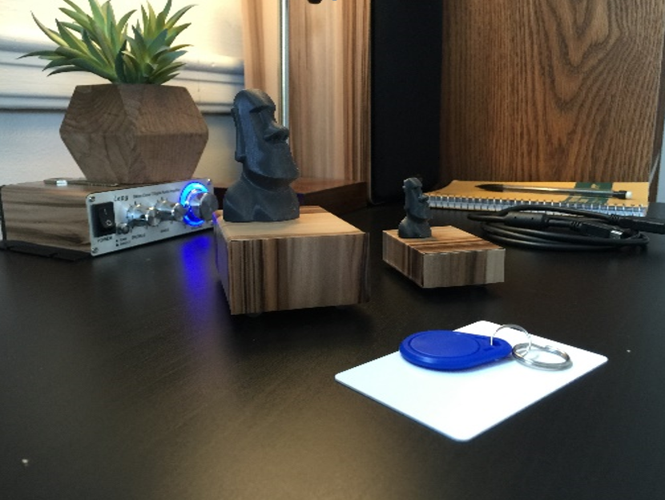
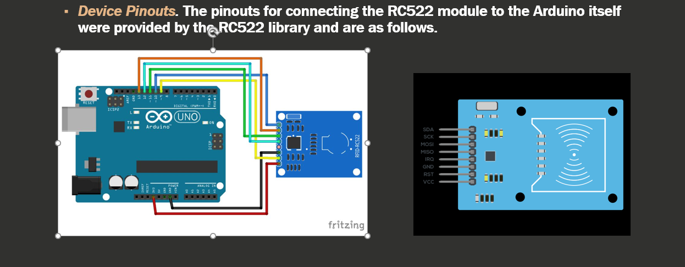

# MoaiBox - V 0.2

MoaiBox is an RFID based application launcher which uses an arduino uno, a RC522 rfid module, and a VB.net windows form application in order to link a shortcut to a card and launch it on scan. Supports minizing to taskbar and custom sound effects

  

## Program Demonstration

## Why

This system was mainly developed to meet the requirements for a school project in a Systems Design and Development course for my Computer Science degree; My main goal in creating this system was to bring tactility to digital content; I miss have to actually handle physical media in order to use it, and had thought this might be a good way to bridge the gap between purely digital content, and the physical media of yesterday; Cards and keyfob scanning seemed like it may have been an interesting solution.

## Getting Started

Open visual studio project in a compatable editor of your choice(Project was created in visual studio 2015) then either edit or build

### Prerequisites

1. A windows computer XP or later
2. A free USB port
3. An Authentic Arduino Uno (Note: From my personal testing, arduino knockoffs that use additional drivers to communicate seem to struggle with the auto connect code; If you want to use a knockoff you might need to re-enable manual com port selection in the code)
4. An RC522 rfid read/writer module for arduino
5. Miifare 1k Rfid storage medium
6. MiguelBabloa's RC522 library (https://github.com/miguelbalboa/rfid)

### Installing

1. Connect RC522 module to arduino following the pinouts specified on the image included with the project.
2. (If required) Install Arduino software and drivers to enable COM communication in windows
3. Open Arduino IDE, click sketch, click include library, add ZIP library, and point to the zip downloaded from MiguelBalboa's repository.
4. Open sketch_feb28b.ino and flash to Arduino Uno
5. Open Visual Studio project and either play or compile

Program is open, connected, and ready to read cards!

## Using the program

1. (Device Connection)
-Once the MoaiBox reader has been assembled, simple plug in and launch the program; The application will attempt to talk to device on the com ports until the MoaiBox itself responds, and initiated the connection logic pointed at that port.

2. (Creating Links)
-To create a new link, simply scan a card that hasn't been linked with the system to auto fill it's UID.
-Click the shortcut browse button and find a program you would like to launch with this card
-Set the name, description, and add a custom sound effect
-Click the add link button to finalize the link
-Scan card again to launch shortcut

3. (Editing links)
-Scan a card which already has a link tied to it's UID
-Edit fields in main program as desired
-Click update link button at bottom of the program
-Scan again to see changes.

## Built With

* [Visual Studio 2015 - VB.net](http://www.dropwizard.io/1.0.2/docs/) - Environment and language used
* [Arduino 1.6.9](https://maven.apache.org/) - To create and upload programs to the Arduino Uno

## Version History

* 0.2 - Added Database card info storage / program customization
* 0.1 - Initial Version of system

## Known bugs

* Currently, device disconnect logic while the program is running will cause the program to crash. Need to add additional try catch statements in order to handle exceptions caused.
* Custom sound effects won't be updated upon update link, need to add sound effects to update statements
* Device never resets to initial state without unplugging first - still sends handshake if the form asks for it though.

## Developer notes
This is very much a prototype application, and probably not one ment for any serious deployment; I'm not sure if I'll ever personally get back to this project as when I actually put the use to practice, it wasn't that much more engaging to use than just clicking an icon on the desktop was; That said,all critical functionality required for this system to function is in place and even in this form it's still pretty usable once the device is built. Feel free to take this, update it, modify it, or use any part of it in your own programs. The Arduino Scanner program only sends the UID of the card in hex format over the serial connection, this could easily be reporposed for any other application requiring a unique number over the com port.

## Author

Joshua Stimpert

## License

This project is licensed under the MIT License - see the [LICENSE.md](LICENSE.md) file for details

